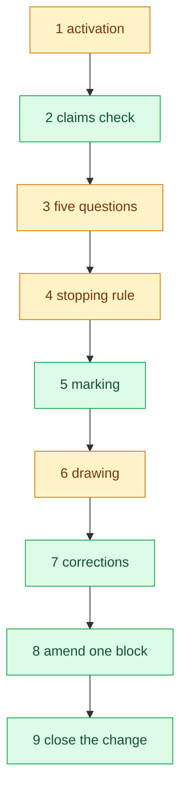
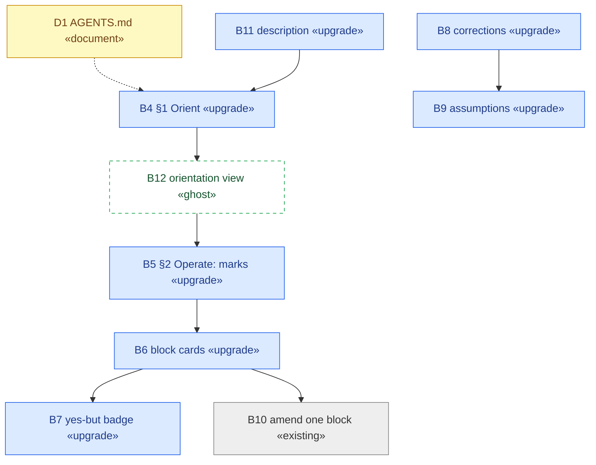
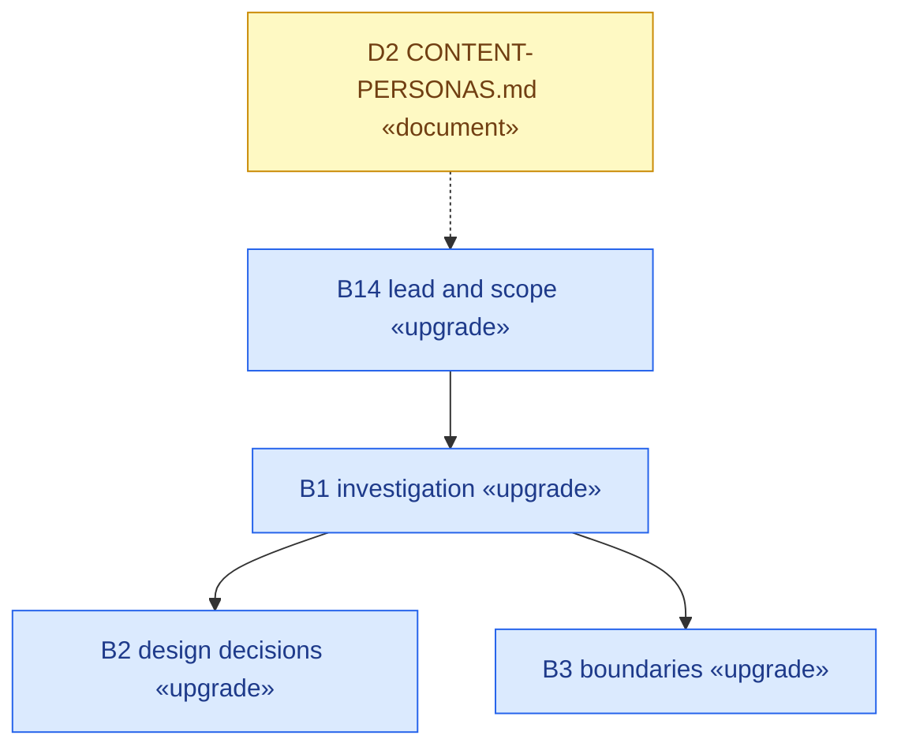
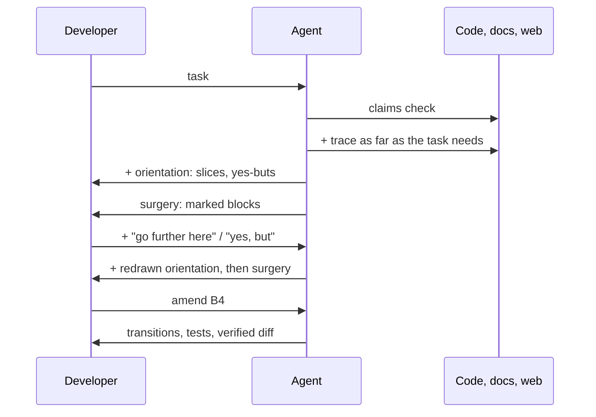
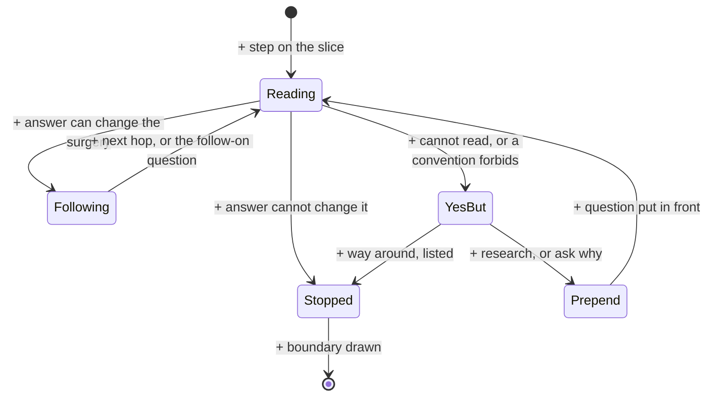

# Blueprint: Blueprinter orients, then operates

Change: Blueprinter works in two phases. **Orient** builds a guided,
task-shaped understanding of the existing system: it traces what the task
needs, as far as the task needs, and may include online research. Its result
is a blueprint of the vertical slices the task touches. **Operate** then
proposes the surgery on that blueprint: marked blocks and one amendment per
block. Questions are factored from the task, and every finding ends in
**ok, now what** or **yes, but**.

## Where the task stands

| Claim | State | Evidence |
| --- | --- | --- |
| Orientation comes before any proposed change | partly met | `SKILL.md:12-43` reads before marking, but its stopping rule is a mark: "Stop reading when every block has a mark" (`SKILL.md:42`) |
| Depth follows the task | contradicted | bounded by layers (`README.md:143-145`, `README.md:61-64`); one-file fixes opt out (`README.md:11-13`, `SKILL.md:3`) |
| Online research may be included | not met | sources are Compass, docs, source (`SKILL.md:26-28`) |
| Orientation's result is vertical slices | not met | views group marked blocks by container (`SKILL.md:90-95`); no as-is view without marks |
| Surgery is proposed on that blueprint, per block | met | marks (`SKILL.md:45-77`), one-block amendment (`SKILL.md:141-154`) |
| Questions are factored per task | contradicted | five fixed questions (`SKILL.md:24-40`) |
| Every finding ends in ok-now-what or yes-but | not met | no verdict; "not allowed to read it" and "they don't like REST" have no place |

## Orientation

One slice is enough for this change: how a task becomes a diff inside the
skill. Each step names what happens and where.

| Step | What happens | Where | Ends |
| --- | --- | --- | --- |
| 1 activation | triggers on a multi-part change; one-file fixes are excluded | `SKILL.md:3`, `README.md:11-13` | **yes, but** with depth set by the task, a small task gets a small orientation, not an opt-out |
| 2 claims check | reads the code behind each claim, logic not signature | `SKILL.md:17-22` | **ok, now what** → becomes the first move of Orient |
| 3 five questions | the same five on every task | `SKILL.md:24-40` | **yes, but** questions are factored from the task |
| 4 stopping rule | stop when every block has a mark and location | `SKILL.md:42-43` | **yes, but** a mark belongs to surgery; orientation stops when more reading cannot change the surgery |
| 5 marking | seven marks, guess rule, one-block rule, permanent IDs | `SKILL.md:45-77` | **ok, now what** → moves under Operate; Existing and Document are set during Orient |
| 6 drawing | strategy, logistics, tactics views of marked blocks, by container | `SKILL.md:79-125` | **yes, but** no as-is view exists → add the orientation view |
| 7 corrections | name a block or layer; redraw; report the delta | `SKILL.md:127-139` | **ok, now what** → add "go further here" and "yes, but" |
| 8 amend one block | transitions, tests, verified diff | `SKILL.md:141-154` | **ok, now what** |
| 9 close the change | commit with the work, remove when landed | `SKILL.md:156-161` | **ok, now what** |

Stopped at: the README sections this change does not touch, and the
neighbouring skills, which the Boundaries already name. Codemaps came from
your reference, not from new research.

## Surgery

### SKILL.md

### README.md

## Build order

1. Scope challenger (D1): this changes what the skill does first.
2. B4 Orient and B12 orientation view.
3. B5 Operate, then B6, B7, B8.
4. B11 description; README B14, B1, B2, B3.
5. `validate_skills.py`, preservation review.

## Block cards

| ID | Mark | Location | Amendment |
| --- | --- | --- | --- |
| B11 | Upgrade | `SKILL.md:3` | drop "Not for one-file fixes"; name orientation; stay within 306 characters |
| B4 | Upgrade | `SKILL.md:8-43` | the opener names the two phases; §1 becomes "Orient": claims check, then questions factored from the task; trace what the task needs, as far as it needs; sources add online research for systems outside the codebase; stop where more reading cannot change the surgery; assign only Existing and Document |
| B12 | Ghost | `SKILL.md` §3, after "Where the task stands" | the orientation view: per slice, numbered steps with what happens, `path:line` or URL, and ok or yes-but; the boundary where tracing stopped is drawn, so it can be named |
| B5 | Upgrade | `SKILL.md:45-77` | becomes "Operate": the change marks are assigned here, on the oriented slices; rules unchanged |
| B6 | Upgrade | `SKILL.md:111-112` | the learning column becomes the yes-but steps the block depends on |
| B7 | Upgrade | `SKILL.md:90-106` | a block that depends on a yes-but step carries `⚠` |
| B8 | Upgrade | `SKILL.md:127-139` | corrections add "go further here", "stop here", and "yes, but …"; each redraws orientation, then surgery |
| B9 | Upgrade | `SKILL.md:122-125` | a yes-but whose way around settles it moves to Assumptions and leaves the card; an unsettled one stays with `⚠`; entries carry block or question IDs |
| B10 | Existing | `SKILL.md:141-154` | none |
| B14 | Upgrade | `README.md:1-13` | lead names the two phases; small tasks get a small orientation instead of an opt-out |
| B1 | Upgrade | `README.md:61-78` | investigation becomes orientation: depth set by the task, questions factored, research allowed |
| B2 | Upgrade | `README.md:128-145` | "bounded by the layers" becomes "bounded by the task"; add: a finding ends in ok or yes-but, never in waiting; questions factored per task; no gate between the phases |
| B3 | Upgrade | `README.md:147-171` | online research reads outside sources; it does not change them |
| D1 | Document | `AGENTS.md` | scope challenger and preservation review |
| D2 | Document | `.context-docs/CONTENT-PERSONAS.md` | README prose |

## Logistics

## Tactics — B4: tracing one step

## Assumptions

- **A1** (B8) — "yes, but …" ends both the agent's findings and the
  developer's replies. Alternative: the agent's findings only.
- **A2** (B9) — A yes-but never stops the work: the agent takes the way
  around and lists it. Alternative: it blocks until you answer.
- **A3** (B5, B12) — No "Blocked" mark. A blocked source is a yes-but step on
  its slice. Alternative: a mark, which breaks one mark per block.
- **A4** (B6) — Learning items become yes-but steps on the slice.
  Alternative: keep a separate learning column.
- **A5** (B3) — Blueprinter names the deploy path and the people to inform;
  it does not deploy or send messages.
- **A6** (B4) — A "who" question can name people and owners as well as
  documents.
- **A7** (B11) — The description stays within 306 characters.
- **A8** (B4) — The five fixed questions go.
- **A11** (B4, B5) — No approval gate between phases: one blueprint holds
  orientation and surgery, and a correction to orientation redraws the
  surgery. Alternative: stop after orientation for your go-ahead.
- **A12** (B11, B14) — The one-file opt-out goes; the skill scales down.
  Alternative: keep small tasks out of scope.
- **A13** (B4) — Online research cites the URL on the step it informs and is
  used only for systems outside the codebase. Alternative: research any
  step.

- **A14** (B4) — Orientation questions take permanent IDs (`Q1`…) under the
  block-ID rule, so "go further at Q4" addresses one. Alternative: unnumbered
  steps.
- **A15** (B4) — Asking why finds the requirement behind an obstacle, not the
  cause of a failure; Read the Terrain keeps unclear causes. Alternative:
  route every why to Read the Terrain.
- **A16** (B4) — The four directions (what, how, who, where) are where
  questions come from, not a checklist. Alternative: drop them.
- **A13** stays an assumption; the README states only that research covers
  systems outside the codebase as an example, not as a rule.

Retired: Q1–Q12, A9, A10. Questions are orientation notes, not blocks.
