# Agent Skills

Agent Skills is a collection of five independently installable skills. Each
addresses a different missing decision: what outcome the work serves, what
evidence-producing move comes next, what a reader must know, what recurring
behavior belongs in a skill, or whether a finished artifact is ready to trust.

AI coding agents can produce convincing work while losing why it exists. They
can start implementation before the outcome and constraints are clear, mistake
completed tasks for progress, document mechanics instead of reader needs, or
rationalize their own output into looking ready.

## What this repository offers

- **[Documentory](skills/documentory/README.md):** creates, revises, audits, and
  maintains technical documentation from an identified reader need to a
  verified publishable result, so each reader gets the necessary truth and
  boundaries at the lowest useful layer.
- **[Skill Guidance](skills/skill-guidance/README.md):** creates and refines
  independently installable agent skills, so an agent loads the right
  instructions, makes the intended choice, and stops on observable evidence.
- **[Verify Complex Artifacts](skills/verify-complex-artifacts/README.md):**
  independently examines finished complex artifacts, so gaps hidden by
  producer context become actionable before a handoff or trust transition.
- **[Read the Terrain](skills/read-the-terrain/README.md):** selects one
  evidence-producing move under consequential uncertainty, so action advances
  the aim or improves the next decision.
- **[Mind Mapper](skills/mind-mapper/README.md):** maintains accountable
  outcome-to-work-to-result lineage, so a collection of capabilities stays
  manageable without becoming an invented pipeline.

Each skill is independently installable. Their support relationships do not
make them stages in one loop or runtime dependencies.

## Choose by problem

| When this is the problem | Route to | Outcome | It does not prove |
| --- | --- | --- | --- |
| Work has become a list of tasks with no accountable path to the wider goal. | [Mind Mapper](skills/mind-mapper/README.md) | Shows why each piece of work exists, what can proceed independently, what is blocked, and which claims have evidence. | That an action caused the outcome or that the goal is valuable. |
| The next move is plausible, but cause and effect are unclear or conditions are changing. | [Read the Terrain](skills/read-the-terrain/README.md) | One bounded move that advances the aim or produces evidence that changes the next decision. | Causality, solution correctness, or requirement coverage. |
| Documentation is missing, stale, misplaced, or describes implementation instead of what a reader needs to understand or do. | [Documentory](skills/documentory/README.md) | Verified, publishable documentation that gives the named reader the necessary purpose, truth, and boundary. | Product decisions, undocumented implementation correctness, or readiness of non-documentation artifacts. |
| Agent instructions contain relevant advice but do not reliably change the intended choice. | [Skill Guidance](skills/skill-guidance/README.md) | A skill that appears for matching work and changes the agent's behavior in a testable way. | Domain correctness or behavioral effectiveness from structure alone. |
| A finished multi-file artifact looks coherent to its producer, but that producer's context may hide gaps. | [Verify Complex Artifacts](skills/verify-complex-artifacts/README.md) | An independent readiness decision that identifies blockers and decisions needing a human. | Product desirability or facts outside the contract and checks actually reviewed. |

## How the skills support each other

There are three supported compositions, not one complete loop:

```mermaid
flowchart TB
    subgraph F1["1 · Documentation"]
        direction LR
        A1["Documentation problem"] --> A2["Documentory"] --> A3["Truthful reader-facing result"]
    end

    subgraph F2["2 · Agent-skill package"]
        direction LR
        B1["Agent-skill problem"] --> B2["Skill Guidance"]
        B1 --> B3["Documentory"]
        B2 -->|"agent-facing contract"| B4["Finished skill package"]
        B3 -->|"reader-facing contract"| B4
        B4 --> B5["Verify Complex Artifacts"]
        B5 --> B6["Refine, block, or hand off"]
    end

    subgraph F3["3 · Wider uncertain documentation work"]
        direction LR
        C1["Wider outcome"] --> C2["Mind Mapper"]
        C2 --> C3["Read the Terrain"]
        C3 --> C4["Documentory"]
        C4 --> C5["Supported meaning reaches the reader"]
    end
```



- **Documentation:** Documentory can complete a documentation task on its own.
- **Agent-skill package:** Skill Guidance owns agent-facing activation and
  execution; Documentory owns reader-facing purpose, locality, and progressive
  disclosure. They shape the package together. Verify Complex Artifacts gives
  the finished multi-file result an independent refinement and readiness gate.
- **Wider uncertain documentation work:** Mind Mapper preserves contribution
  lineage, Read the Terrain selects an evidence-producing move on the relevant
  uncertain branch, and Documentory publishes only the supported meaning.

Mind Mapper is also the management view over the collection. It can attach each
skill to the outcome branch it may influence, expose missing or duplicated
coverage, and maintain the action frontier. That relationship is goal lineage,
not invocation: using a skill is activity, not proof that the wider outcome
moved.

Documentory and Skill Guidance are reciprocal authoring disciplines.
Documentory's locality and progressive-disclosure model shapes how Skill
Guidance separates maintainer support from runtime instructions. Skill Guidance
supplies the agent-skill packaging discipline used to maintain Documentory.
Each package still works when installed alone.

Compatible agents route to whichever installed skill matches the problem. The
diagram describes how their outcomes can relate; it is not a prompt recipe or a
required execution order.

## Install

From the project that should use the skills, install from the public repository:

```bash
npx skills add theKashey/skills
```

The installer asks which skills to add and which detected agents should receive
them. By default, it installs them for the current project.

Install one skill for Codex:

```bash
npx skills add theKashey/skills --skill documentory --agent codex
```

Add `--global` to either command to make the selected skills available across
projects. See the [skills CLI supported-agent
list](https://github.com/vercel-labs/skills#supported-agents) for agent names
and install locations.

## Capability details

### Documentory

Documentation may not exist at all. When it does, it can still be written from
the producer's implementation view instead of the reader's decision, hide why
the subject exists, place detail at the wrong layer, or publish temporary state
as a durable contract.

Documentory owns the full cycle: decide whether documentation is needed; create,
revise, or audit the appropriate README, reference, example, public contract, or
code-local rationale; verify it against the finished system; and keep it
maintainable. Use it wherever a named reader must act safely from the finished
result.

Read [why Documentory exists and how it is maintained](skills/documentory/README.md)
or inspect its [runtime documentation workflow](skills/documentory/SKILL.md).

### Skill Guidance

An agent skill fails when it contains information without changing the intended
choice. Mixing activation, runtime action, maintainer explanation, and
mechanical enforcement makes the package expensive to load and difficult to
route, while a structural pass can hide that behavior never changed.

Skill Guidance decides whether an unresolved agent choice belongs in a skill,
reference, README, deterministic gate, amendment, split, or no runtime content.
It keeps the admitted package independently installable and requires behavioral
evidence for the choice it is meant to change.

Read [why Skill Guidance exists and how its surfaces divide
responsibility](skills/skill-guidance/README.md) or inspect its
[runtime skill-authoring workflow](skills/skill-guidance/SKILL.md).

### Verify Complex Artifacts

The context that helps a model produce an artifact also helps it rationalize
that artifact. Local checks and producer self-review can therefore pass a
polished result whose subject is unclear, whose relationships are invented, or
whose consumer paths disagree.

Verify Complex Artifacts treats those gaps as expected refinement signals. It
separates factual, deterministic, consumer-surface, isolated subject, and human
acceptance evidence so one kind of confidence cannot stand in for another. A
fresh reviewer—not the producer—must reconstruct the delivered result from the
target alone.

Read [why independent refinement is needed and which damage it
targets](skills/verify-complex-artifacts/README.md) or inspect its
[runtime verification workflow](skills/verify-complex-artifacts/SKILL.md).

### Read the Terrain

Uncertainty becomes dangerous when an agent keeps acting without learning.
Familiar patterns, more analysis, or another implementation attempt may all
look productive while leaving the signal—and therefore the next decision—
unchanged.

Read the Terrain is for choosing one bounded move whose result matters. Use it
when cause and effect are unclear, conditions are changing, or an artifact may
be solving a different problem from the one its producer describes. The move
must advance the aim or improve what can be decided next.

Read [why to use Read the Terrain](skills/read-the-terrain/README.md) or inspect
its [runtime decision workflow](skills/read-the-terrain/SKILL.md).

### Mind Mapper

Useful work becomes unmanageable when its path to the wider outcome is missing.
Tasks become ends in themselves, results acquire retrospective stories, and a
set of independent capabilities is mistaken for a pipeline.

Mind Mapper connects the collection without coupling it. It maps each skill as
a candidate attack angle beneath an outcome, preserves backlinks from results
to that outcome, exposes weak or open edges, and distinguishes gaps that need
understanding from moves that are ready to execute.

Read [why Mind Mapper manages the collection](skills/mind-mapper/README.md) or
inspect its [runtime goal-lineage workflow](skills/mind-mapper/SKILL.md).

## License

[MIT](LICENSE) © 2026 Anton Korzunov.
