# Agent Skills

Context Docs is the cornerstone and main offering of this repository. Code and
system structure often show what happens without preserving why a surprising
constraint, boundary, or relationship must exist. Context Docs recovers that
verified explanation before a maintainer or coding agent changes the wrong
thing.

The other five skills support decisions connected to that work:
what outcome it serves, what evidence-producing move comes next, what recurring
behavior belongs in a skill, whether a finished artifact is ready to trust, or
when structure rather than prose should carry a documented constraint.
Each skill, including Context Docs, remains independently installable.

AI coding agents can produce convincing work while losing why it exists. They
can start implementation before the outcome and constraints are clear, mistake
completed tasks for progress, document mechanics instead of reader needs, or
rationalize their own output into looking ready.

## What this repository offers

- **[Context Docs](skills/context-docs/README.md):** preserves verified
  explanations for fences—causes in lower-level implementation, another
  process, or another point in time that are not visible where their constraint
  affects a decision.
- **[Skill Guidance](skills/skill-guidance/README.md):** creates and refines
  independently installable agent skills, so an agent loads the right
  instructions, makes the intended choice, and stops on observable evidence.
- **[Verify Complex Artifacts](skills/verify-complex-artifacts/README.md):**
  independently examines finished complex artifacts, so gaps hidden by
  producer context become actionable before a handoff or trust transition.
- **[Read the Terrain](skills/read-the-terrain/README.md):** selects one
  evidence-producing move under consequential uncertainty, so action advances
  the aim or improves the next decision.
- **[Helix](skills/helix/README.md):** runs an expand, spike, and collapse
  cycle over a small rewritten checkpoint, so uncertain work advances by
  evidence instead of accumulating plans.
- **[Screaming Reefs](skills/screaming-reefs/README.md):** makes a verified
  constraint visible in structure, so a reader can act safely without relying
  on a remote explanation.

Each skill is independently installable. Their support relationships do not
make them stages in one loop or runtime dependencies.

## Choose by problem

| When this is the problem | Route to | Outcome | It does not prove |
| --- | --- | --- | --- |
| Code or system structure exposes behavior without the reason a constraint, boundary, or relationship must exist. | [Context Docs](skills/context-docs/README.md) | A verified explanation at the surface where the affected reader encounters the decision. | Product decisions, undocumented implementation correctness, or readiness of non-documentation artifacts. |
| Direction under uncertainty is unresolved, or work has become a list of tasks with no accountable path to the wider goal. | [Helix](skills/helix/README.md) | One selected branch probed by a bounded spike, with the result collapsed into a checkpoint that keeps verdicts and epitaphs rather than plans. Requires a checkpoint surface the user configures before the first cycle. | That an action caused the outcome or that the goal is valuable. |
| The next move is plausible, but cause and effect are unclear or conditions are changing. | [Read the Terrain](skills/read-the-terrain/README.md) | One bounded move that advances the aim or produces evidence that changes the next decision. | Causality, solution correctness, or requirement coverage. |
| Agent instructions contain relevant advice but do not reliably change the intended choice. | [Skill Guidance](skills/skill-guidance/README.md) | A skill that appears for matching work and changes the agent's behavior in a testable way. | Domain correctness or behavioral effectiveness from structure alone. |
| A finished multi-file artifact looks coherent to its producer, but that producer's context may hide gaps. | [Verify Complex Artifacts](skills/verify-complex-artifacts/README.md) | An independent readiness decision that identifies blockers and decisions needing a human. | Product desirability or facts outside the contract and checks actually reviewed. |
| A verified constraint is still carried only by prose, and an authorized structural change can make it visible to local readers. | [Screaming Reefs](skills/screaming-reefs/README.md) | The smallest structural owner for the constraint, with the irreducibly remote cause retained as prose. | That structure proves behavior or authorizes a wider redesign. |

## How the skills support each other

There are four supported compositions, not one complete loop:

```mermaid
flowchart TB
    subgraph F1["1 · Documentation"]
        direction LR
        A1["Documentation problem"] --> A2["Context Docs"] --> A3["Truthful reader-facing result"]
    end

    subgraph F2["2 · Agent-skill package"]
        direction LR
        B1["Agent-skill problem"] --> B2["Skill Guidance"]
        B1 --> B3["Context Docs"]
        B2 -->|"agent-facing contract"| B4["Finished skill package"]
        B3 -->|"reader-facing contract"| B4
        B4 --> B5["Verify Complex Artifacts"]
        B5 --> B6["Refine, block, or hand off"]
    end

    subgraph F3["3 · Wider uncertain documentation work"]
        direction LR
        C1["Wider outcome"] --> C2["Helix"]
        C2 --> C3["Read the Terrain"]
        C3 --> C4["Context Docs"]
        C4 --> C5["Supported meaning reaches the reader"]
    end

    subgraph F4["4 · Structural enforcement"]
        direction LR
        D1["Documented reef"] --> D2["Screaming Reefs"]
        D2 -->|"authorized change"| D3["Constraint visible in structure"]
    end
```



- **Documentation:** Context Docs can complete a documentation task on its own.
- **Agent-skill package:** Skill Guidance owns agent-facing activation and
  execution; Context Docs owns reader-facing purpose, locality, and progressive
  disclosure. They shape the package together. Verify Complex Artifacts gives
  the finished multi-file result an independent refinement and readiness gate.
- **Wider uncertain documentation work:** Helix selects the branch worth
  probing and collapses what the probe returns, Read the Terrain selects an
  evidence-producing move on that branch, and Context Docs publishes only the
  supported meaning.
- **Structural enforcement:** Screaming Reefs can follow Context Docs when an
  explicitly authorized structural change can carry a verified constraint more
  reliably than prose. A documentation finding is not authorization for that
  change.

Helix is also the management view over the collection. It can treat each skill
as a candidate branch beneath an outcome, expose missing or duplicated
coverage, and select the next branch to probe from current evidence and work
state. That relationship is goal lineage, not invocation: using a skill is
activity, not proof that the wider outcome moved.

Context Docs and Skill Guidance are reciprocal authoring disciplines.
Context Docs' locality and progressive-disclosure model shapes how Skill
Guidance separates maintainer support from runtime instructions. Skill Guidance
supplies the agent-skill packaging discipline used to maintain Context Docs.
Each package still works when installed alone.

Compatible agents route to whichever installed skill matches the problem. The
diagram describes how their outcomes can relate; it is not a prompt recipe or a
required execution order.

## Install

From the project that should use the skills, install from the public repository:

```bash
npx skills add theKashey/skills
```

The installer asks which skills to add and which detected agents should receive
them. By default, it installs them for the current project.

Install one skill for Codex:

```bash
npx skills add theKashey/skills --skill context-docs --agent codex
```

Add `--global` to either command to make the selected skills available across
projects. See the [skills CLI supported-agent
list](https://github.com/vercel-labs/skills#supported-agents) for agent names
and install locations.

## Capability details

### Context Docs

Code usually exposes mechanics. It often does not expose why a surprising
choice, constraint, boundary, or relationship must exist. A lower-level
implementation detail, parallel process, or earlier or later event can affect
the current decision without being visible here. That hidden causal edge is a
fence: without it, a locally reasonable edit can violate a non-local
requirement.

Context Docs documents reefs, not cliffs. It recovers the verified hidden reason,
omits mechanics already visible, and uses locality to place the explanation in
the README, reference, public contract, example, or code-local rationale where
the affected reader naturally encounters the decision. It owns the full
documentation cycle without turning every visible detail into prose.

Read [why Context Docs exists and how it is maintained](skills/context-docs/README.md)
or inspect its [runtime documentation workflow](skills/context-docs/SKILL.md).

### Skill Guidance

An agent skill fails when it contains information without changing the intended
choice. Mixing activation, runtime action, maintainer explanation, and
mechanical enforcement makes the package expensive to load and difficult to
route, while a structural pass can hide that behavior never changed.

Skill Guidance decides whether an unresolved agent choice belongs in a skill,
reference, README, deterministic gate, amendment, split, or no runtime content.
It keeps the admitted package independently installable and requires behavioral
evidence for the choice it is meant to change.

Read [why Skill Guidance exists and how its surfaces divide
responsibility](skills/skill-guidance/README.md) or inspect its
[runtime skill-authoring workflow](skills/skill-guidance/SKILL.md).

### Verify Complex Artifacts

The context that helps a model produce an artifact also helps it rationalize
that artifact. Local checks and producer self-review can therefore pass a
polished result whose subject is unclear, whose relationships are invented, or
whose consumer paths disagree.

Verify Complex Artifacts treats those gaps as expected refinement signals. It
separates factual, deterministic, consumer-surface, isolated subject, and human
acceptance evidence so one kind of confidence cannot stand in for another. A
fresh reviewer—not the producer—must reconstruct the delivered result from the
target alone.

Read [why independent refinement is needed and which damage it
targets](skills/verify-complex-artifacts/README.md) or inspect its
[runtime verification workflow](skills/verify-complex-artifacts/SKILL.md).

### Read the Terrain

Uncertainty becomes dangerous when an agent keeps acting without learning.
Familiar patterns, more analysis, or another implementation attempt may all
look productive while leaving the signal—and therefore the next decision—
unchanged.

Read the Terrain is for choosing one bounded move whose result matters. Use it
when cause and effect are unclear, conditions are changing, or an artifact may
be solving a different problem from the one its producer describes. The move
must advance the aim or improve what can be decided next.

Read [why to use Read the Terrain](skills/read-the-terrain/README.md) or inspect
its [runtime decision workflow](skills/read-the-terrain/SKILL.md).

### Helix

Planning under uncertainty decays in two directions. Plans accumulate until
maintaining them costs more than reading them, or work proceeds with no path
back to the outcome, so tasks become ends in themselves and results acquire
retrospective stories.

Helix keeps direction and evidence in one cycle. Expand re-derives candidate
branches fresh and drops any whose outcome would not change the next decision,
Spike probes one branch within a declared boundary, and Collapse files what
returned — delivered work to the stores of record, retired branches to
epitaphs that stop the same dead branch returning under a new name, and the
rest disposed. The checkpoint between cycles holds verdicts, not deliberation.

Read [why Helix keeps a cycle instead of a plan](skills/helix/README.md) or
inspect its [runtime loop](skills/helix/SKILL.md).

### Screaming Reefs

Important constraints often survive only because a comment, README, or agent
instruction explains them. That prose protects the decision, but a reader
acting from selective context—a diff, a symbol, a search match—can miss it,
and a copy far from its owner can drift as the repository changes.

Screaming Reefs turns a verified reef into a cliff: it gives a documented
constraint a structural owner—names, types, API shape, ownership boundaries,
or filesystem topology—under an explicit authorization test. Prose is retired
only after a fresh-context readback passes; a constraint whose significance is
irreducibly non-local stays documented.

Read [why Screaming Reefs exists and where its
boundaries are](skills/screaming-reefs/README.md) or inspect its
[runtime structural-change workflow](skills/screaming-reefs/SKILL.md).

## License

[MIT](LICENSE) © 2026 Anton Korzunov.
