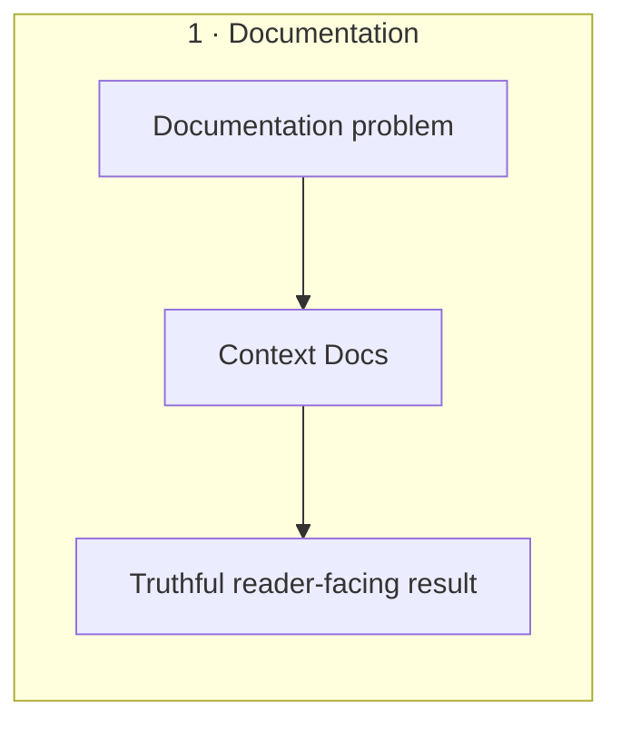
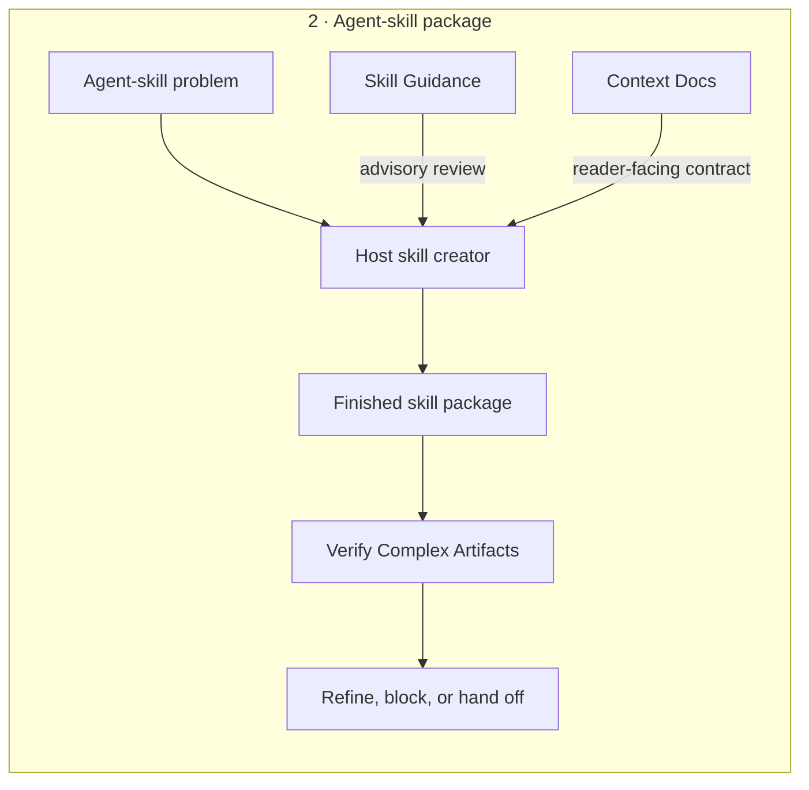
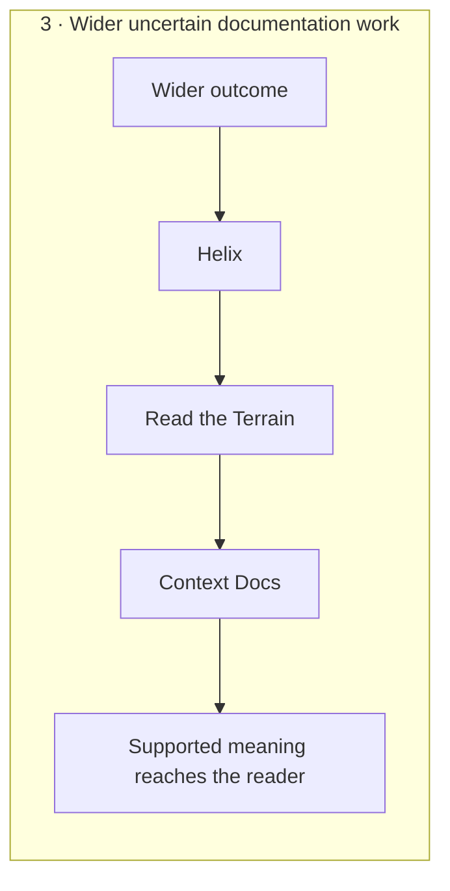
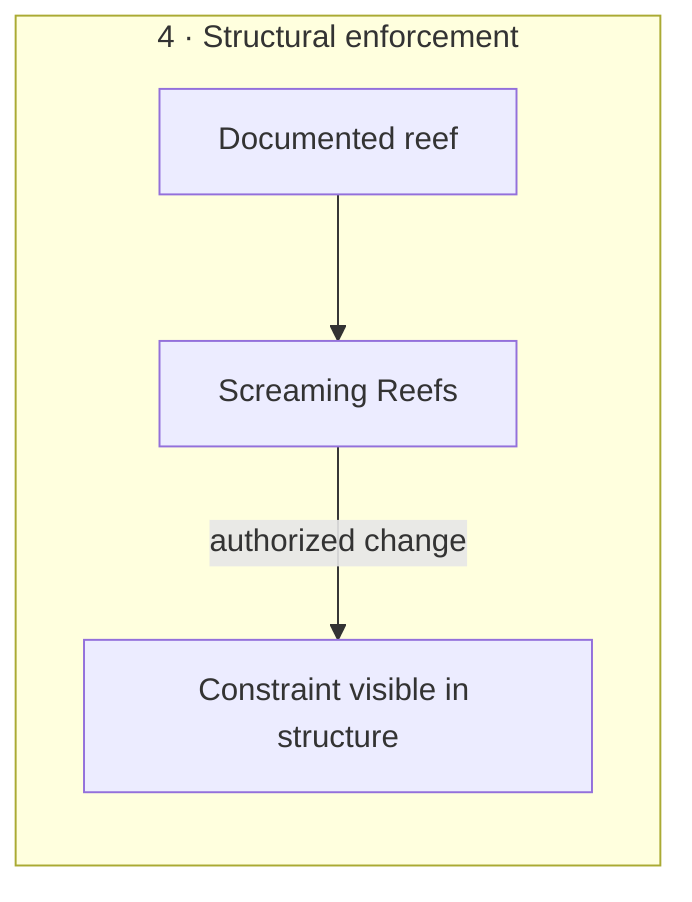

# Agent Skills

"Producing more" is no longer the problem. The harder problem is
keeping the reason for the work, the uncertainty around the next move, and the
evidence needed to trust the result from disappearing as the work accelerates.

AI coding agents can produce convincing work while losing why it exists. They
can start implementation before the outcome and constraints are clear, mistake
completed tasks for progress, document mechanics instead of reader needs, or
rationalize their own output into looking ready.

This repository packages bounded responses to those failures as
independently installable Markdown skills. Each skill defines a decision
procedure with observable completion or an explicit non-pass state; none owns
the whole development lifecycle.

Context Docs is the main skill. It recovers verified reasons that code or
system structure cannot show where a decision is made, putting an invisible
requirement back in view before a locally reasonable change. Independent
companion skills address outcome lineage, evidence-producing moves,
engineering-flow shaping, completion-claim interrogation, advisory
agent-instruction review, independent
final review, structural enforcement of documented constraints, and an
agent-generated architecture chart that keeps place and boundary addressable.

These interventions are designed for stressed work: context has accumulated,
competing information dilutes attention, and a model can rationalize a
plausible account of its own output. A clean isolated exercise removes those
conditions. It can test routing, structure, or reconstructability, but it does
not establish that a skill improves behavior under production stress; that
requires representative target-harness observations that this repository does
not yet provide.

## What this repository offers

- **[Context Docs](skills/context-docs/README.md):** applies the Chesterton's
  Fence test before alteration, then preserves verified invisible reefs—non-local
  causes and material consequences that are not visible where they affect a
  decision.
- **[Skill Guidance](skills/skill-guidance/README.md):** advises a host skill
  creator on activation, runtime choices, isolation, and behavioral evaluation.
  Its [Laws of Agent Instruction](skills/skill-guidance/LAWS.md) name the
  design constraints used in that review.
- **[Verify Complex Artifacts](skills/verify-complex-artifacts/README.md):**
  independently examines finished complex artifacts and records gaps hidden by
  producer context before a handoff or trust transition. Its
  [SINS taxonomy](skills/verify-complex-artifacts/SINS.md) gives recurring
  observed defects stable names.
- **[Retrospective](skills/retrospective/README.md):** cross-examines an
  existing solution's completion claim — reconstructing the problem that would
  make the candidate reasonable, then testing whether it exists, matters, and
  changed for the intended beneficiary.
- **[Read the Terrain](skills/read-the-terrain/README.md):** selects one
  bounded move under consequential uncertainty and requires it to advance the
  aim or improve the next decision.
- **[Carry the Load](skills/carry-the-load/README.md):** shapes a selected
  engineering change into one complete value-bearing increment with bounded
  failure, an audited protection set, and evidence-backed learning.
- **[Helix](skills/helix/README.md):** runs an expand, spike, and collapse
  cycle over a small rewritten checkpoint and requires evidence before treating
  uncertain work as progress.
- **[Screaming Reefs](skills/screaming-reefs/README.md):** makes a verified
  constraint recoverable from names, types, APIs, ownership boundaries, or
  filesystem structure instead of only from a remote explanation.
- **[Compass](skills/compass/README.md):** maintains an agent-generated,
  human-ratified semantic architecture chart — logical roots, scoped L0–L4
  levels, a glossary, viewports, and code coordinates — so every file and
  boundary has an address on the path of work, and the chart survives a
  reimplementation of the code beneath it.

Each skill is independently installable. Their support relationships do not
make them stages in one loop or runtime dependencies.

## Choose by problem

| When this is the problem | Route to | Outcome | It does not prove |
| --- | --- | --- | --- |
| Code or system structure exposes behavior without the reason a constraint, boundary, or relationship must exist. | [Context Docs](skills/context-docs/README.md) | A verified explanation at the surface where the affected reader encounters the decision. | Product decisions, undocumented implementation correctness, or readiness of non-documentation artifacts. |
| Direction under uncertainty is unresolved, or work has become a list of tasks with no accountable path to the wider goal. | [Helix](skills/helix/README.md) | One selected branch probed by a bounded spike, with the result collapsed into a checkpoint that keeps verdicts and epitaphs rather than plans. Requires a checkpoint surface the user configures before the first cycle. | That an action caused the outcome or that the goal is valuable. |
| The next move is plausible, but cause and effect are unclear or conditions are changing. | [Read the Terrain](skills/read-the-terrain/README.md) | One bounded move that advances the aim or produces evidence that changes the next decision. | Causality, solution correctness, or requirement coverage. |
| A move or outcome is already selected, but implementation risks expanding into a large batch, success-only rollout, or accumulating safeguards. | [Carry the Load](skills/carry-the-load/README.md) | One complete increment with a frozen misfire and containment, verified by an executed readback, with material learning routed to an established owner. | That the selected outcome is valuable, what caused an unknown failure, or that the final product is desirable. |
| A proposed or existing skill needs an evidence-backed review of activation, runtime choices, isolation, or context cost. | [Skill Guidance](skills/skill-guidance/README.md) | Advisory findings and validation evidence for the host-provided skill creator. | Domain correctness, authority to mutate the skill, or behavioral effectiveness from structure alone. |
| A finished multi-file artifact looks coherent to its producer, but that producer's context may hide gaps. | [Verify Complex Artifacts](skills/verify-complex-artifacts/README.md) | An independent readiness decision that identifies blockers and decisions needing a human. | Product desirability or facts outside the contract and checks actually reviewed. |
| A solution is presented as done or working, but its claim may rest on a substituted, invented, self-created, or lower-priority problem. | [Retrospective](skills/retrospective/README.md) | A reconstructed problem, a decision ledger over consequential oddities, and one claim verdict inside an explicit evidence boundary. | Implementation correctness, security, product desirability, or requirement coverage beyond the evidence actually examined. |
| A verified constraint is still carried only by prose, and an authorized structural change can make it visible to local readers. | [Screaming Reefs](skills/screaming-reefs/README.md) | The smallest structural owner for the constraint, with the irreducibly remote cause retained as prose. | That structure proves behavior or authorizes a wider redesign. |
| Work starts without knowing where things live, which boundary it is inside, or which external systems are real peers. | [Compass](skills/compass/README.md) | A generated, human-ratified semantic chart with a registry, glossary, viewports, and code coordinates that keeps place and purpose addressable across implementation change. | Boundary quality, code behavior beyond the checked gates, or that the finished chart gets used. |

## How the skills support each other

There are four supported compositions, not one complete loop:

**Documentation:** Context Docs can complete a documentation task on its own.



**Agent-skill package:** The host-provided skill creator owns creation and
mutation. Skill Guidance can advise on the agent-facing contract, while Context
Docs governs reader-facing truth, locality, and progressive disclosure. Verify
Complex Artifacts gives the finished multi-file result an independent
refinement and readiness gate.



**Wider uncertain documentation work:** Helix selects the branch worth
probing and collapses what the probe returns, Read the Terrain selects an
evidence-producing move on that branch, and Context Docs publishes only the
supported meaning.



**Structural enforcement:** Screaming Reefs gives a documented constraint a
structural owner—such as a name, type, API, ownership boundary, or filesystem
location—when that change is explicitly authorized. A documentation finding
does not authorize the change.



Helix is also the management view over the collection. It can treat each skill
as a candidate branch beneath an outcome, expose missing or duplicated
coverage, and select the next branch to probe from current evidence and work
state. That relationship is goal lineage, not invocation: using a skill is
activity, not proof that the wider outcome moved.

Context Docs and Skill Guidance offer independent review lenses to a host skill
creator. Context Docs covers reader-facing truth and locality; Skill Guidance
advises on activation, runtime decisions, isolation, and evaluation. Neither
package creates or mutates the other, and each still works when installed
alone.

The host agent decides which installed skill description matches the problem;
this repository does not orchestrate that selection. The diagrams describe how
the resulting outcomes can relate; they are not a prompt recipe or required
execution order.

## Install

From the project that should use the skills, install from the public repository:

```bash
npx skills add theKashey/skills
```

The installer asks which skills to add and which detected agents should receive
them. By default, it installs them for the current project.

Install one skill for Codex:

```bash
npx skills add theKashey/skills --skill context-docs --agent codex
```

Add `--global` to either command to make the selected skills available across
projects. See the [skills CLI supported-agent
list](https://github.com/vercel-labs/skills#supported-agents) for agent names
and install locations.

## Capability details

### Context Docs

Code usually exposes mechanics. It often does not expose why a surprising
choice, constraint, boundary, or relationship must exist. Context Docs treats
that unknown purpose as Chesterton's Fence and investigates it before changing
or removing the present form. A lower-level implementation detail, parallel
process, or earlier or later event may then establish an invisible reef: a
verified non-local cause with a material consequence here.

Context Docs preserves invisible reefs, not visible cliffs. It keeps the
verified hidden reason, omits meaning already recoverable, and uses locality to
place the explanation in the README, reference, public contract, example, or
code-local rationale where the affected reader naturally encounters the
decision. It owns the full documentation cycle without turning every visible
detail into prose.

Read [why Context Docs exists and how it is maintained](skills/context-docs/README.md)
or inspect its [runtime documentation workflow](skills/context-docs/SKILL.md).

### Skill Guidance

An agent skill fails when it contains information without changing the intended
choice. Mixing activation, runtime action, maintainer explanation, and
mechanical enforcement makes the package expensive to load and difficult to
route, while a structural pass can hide that behavior never changed.

Skill Guidance reviews whether an unresolved agent choice belongs in a skill,
reference, README, deterministic gate, amendment, split, or no runtime content.
It returns evidence-backed advice to the host-provided skill creator; it does
not create or edit the target package.

Read [why Skill Guidance exists and how its surfaces divide
responsibility](skills/skill-guidance/README.md) or inspect its
[runtime advisory workflow](skills/skill-guidance/SKILL.md).

### Verify Complex Artifacts

The context that helps a model produce an artifact also helps it rationalize
that artifact. Local checks and producer self-review can therefore pass a
polished result whose subject is unclear, whose relationships are invented, or
whose consumer paths disagree.

Verify Complex Artifacts tests for those gaps as refinement signals. It
separates factual, deterministic, consumer-surface, isolated subject, and human
acceptance evidence so one kind of confidence cannot stand in for another. A
fresh reviewer—not the producer—must reconstruct the delivered result from the
target alone.

Read [why independent refinement is needed and which damage it
targets](skills/verify-complex-artifacts/README.md) or inspect its
[runtime verification workflow](skills/verify-complex-artifacts/SKILL.md).

### Retrospective

When an AI agent produces the implementation and its explanation in the same
context, the explanation can become a closed proof: the solution justifies the
decisions, and those decisions are offered as proof that the solution was
necessary. Polished code and green tests can still hide a substituted,
invented, manufactured, or lower-priority problem — or a mechanism that only
proves its own activity.

Retrospective freezes the candidate and its exact “works” claim, reconstructs
the problem backwards without borrowing the implementation's vocabulary,
follows every consequential oddity to its current evidence, and refuses to
treat “real problem” as equivalent to “right problem.” It ends in one claim
verdict — support, a named condition, misalignment, refutation, or an explicit
unresolved boundary — instead of a smoother rationale.

It sits upstream of Verify Complex Artifacts, which gates a finished artifact
against a frozen contract; Retrospective interrogates the claim behind that
contract. Read the Terrain owns one bounded evidence-producing move inside
live work; Retrospective owns the full interrogation of a finished claim.

Read [why Retrospective exists and which mismatches it
targets](skills/retrospective/README.md) or inspect its
[runtime interrogation workflow](skills/retrospective/SKILL.md).

### Read the Terrain

Uncertainty becomes dangerous when an agent keeps acting without learning.
Familiar patterns, more analysis, or another implementation attempt may all
look productive while leaving the signal—and therefore the next decision—
unchanged.

Read the Terrain is for choosing one bounded move whose result matters. Use it
when cause and effect are unclear, conditions are changing, or an artifact may
be solving a different problem from the one its producer describes. The move
must advance the aim or improve what can be decided next.

Read [why to use Read the Terrain](skills/read-the-terrain/README.md) or inspect
its [runtime decision workflow](skills/read-the-terrain/SKILL.md).

### Carry the Load

Once a move is selected, a plausible default is to build a comprehensive
candidate, protect it broadly, and verify it near the end. Work expands into
large batches and speculative scope, safeguards accumulate without a named
load, and a rule fitted to the visible examples ships as if it were universal.

Carry the Load freezes a load card — value, constraint, increment, credible
misfire, containment, and readback — before the first mutating action, then
moves one complete increment through implementation to an executed readback.
It bounds how a wrong result can fail, audits every protection the increment
adds or challenges, and routes material learning to code, a deterministic
gate, or a conditional behavior-principle procedure under explicit authority.

It sits downstream of Read the Terrain, which chooses the move when cause and
effect are unclear; Carry the Load shapes the selected move's implementation,
containment, and learning, and it does not choose the product outcome or
diagnose an unknown cause.

Read [why Carry the Load exists and which defaults it
replaces](skills/carry-the-load/README.md) or inspect its
[runtime flow workflow](skills/carry-the-load/SKILL.md).

### Helix

Planning under uncertainty decays in two directions. Plans accumulate until
maintaining them costs more than reading them, or work proceeds with no path
back to the outcome, so tasks become ends in themselves and results acquire
retrospective stories.

Helix keeps direction and evidence in one cycle. Expand re-derives candidate
branches fresh and drops any whose outcome would not change the next decision,
Spike probes one branch within a declared boundary, and Collapse files what
returned — delivered work to the stores of record, retired branches to
epitaphs that stop the same dead branch returning under a new name, and the
rest disposed. The checkpoint between cycles holds verdicts, not deliberation.

Read [why Helix keeps a cycle instead of a plan](skills/helix/README.md) or
inspect its [runtime loop](skills/helix/SKILL.md).

### Screaming Reefs

Important constraints often survive only because a comment, README, or agent
instruction explains them. That prose protects the decision, but a reader
acting from selective context—a diff, a symbol, a search match—can miss it,
and a copy far from its owner can drift as the repository changes.

Screaming Reefs turns a verified invisible reef into a visible cliff: it gives
a documented constraint a structural owner—names, types, API shape, ownership
boundaries, or filesystem topology—under an explicit authorization test. Prose
is retired only after a fresh-context readback passes; a constraint whose
significance is irreducibly non-local stays documented.

Read [why Screaming Reefs exists and where its
boundaries are](skills/screaming-reefs/README.md) or inspect its
[runtime structural-change workflow](skills/screaming-reefs/SKILL.md).

### Compass

To a coding agent, structure that is not on the path of work does not exist:
decisions recorded in passive files get sailed past, and locally reasonable
changes land inside the wrong boundary. Compass maintains the missing chart —
a semantic architecture knowledge base under a chart root the host project
declares, with one or more human-ratified logical roots, a scoped L0–L4 level
stack borrowing C4's zoom vocabulary, a per-root glossary, a tiered registry
that records demotions so nothing is silently re-elevated, viewports for
cross-cutting flows, and `// compass:` coordinates that bind code to the chart
minimally and checkably.

The chart describes what the system is, not how the repository is arranged: a
codebase is one realization, and the design test is that the chart survives its
complete rewrite while the coordinates are replaced. Chart/code disagreement is
therefore classified — semantic change, implementation remapping, or
implementation violation — rather than repaired by assuming code is right.

Every chart document is agent-generated; the human contributes judgment
through explicit checkpoints and never writes chart content by hand.
Verification gates — root admission, the single-box rule, two orthogonal L1
tests, per-level checklists, level calibration, and a spot check — measure
completion instead of prose confidence.

Read [why Compass exists and which failures it
answers](skills/compass/README.md) or inspect its
[runtime chart workflow](skills/compass/SKILL.md).

## License

[MIT](LICENSE) © 2026 Anton Korzunov.
